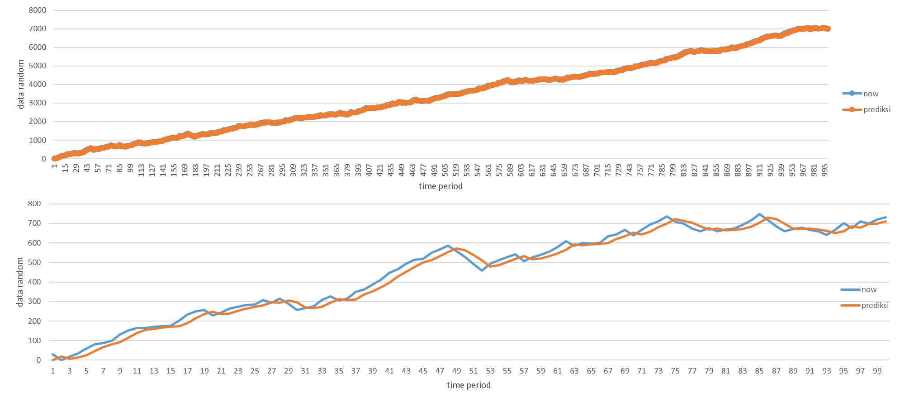

# KalmanManual

This is an example implementation of kalman filter. This tutorial make prediction 1000 data random.  

For further details of kalman filter, you can visit this site.
1. http://bilgin.esme.org/BitsAndBytes/KalmanFilterforDummies
2. http://www.cs.cornell.edu/courses/cs4758/2012sp/materials/MI63slides.pdf  
Those sites help me great deal for me. Hopefully, it can helps you who needed.
